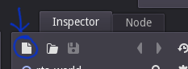
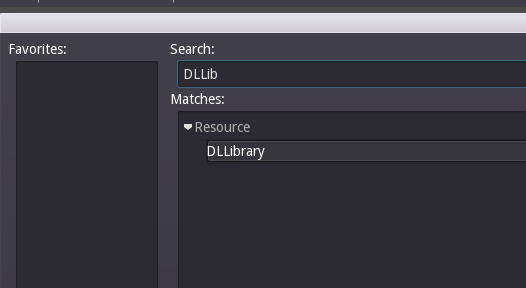
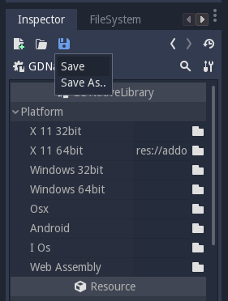

# FAQ

### What is GDNative?
GDNative is a module that enables you to use shared libraries, which are dynamically linked, for scripting. GDNative was originally named "cscript" because it exposes a C API, but people thought it was related to C#, which is sometimes abbreviated as "cs". Then it was named "DLScript" but that brought up some confusion, so we settled with GDNative. You can build these libraries with C++ as well as C, D, Rust, or any other language that supports C linkage and creating dynamic libraries.

One of the immediate powers to native scripts is the ability to link other shared libraries or to use critical code without recompiling the engine.

Currently there are [C++ bindings](https://github.com/GodotNativeTools/cpp_bindings) that make developing for Godot with C++ easier, but **native scripts are not limited to C++.**

### Are native scripts on the offical builds?
**Yes.**

### Can you use one library for all scripts?
**Yes.** You may use one library for all scripts. Remember the name field that is always greyed out for GDScript? You need to set a name for the script here.

### Can you debug native scripts?
**Yes.** You must compile the library with debug symbols, and then you can use your debugger as usual.

### Can I use GDScript in the same project?
**Yes.** You may use native scripts and GDScripts in the same project.

### How can I add my own bindings for native scripts?
**More details will be available soon.**

### What are the requirements?
Linux implementation is tested. OSX and Android *should* work as well. Windows is implemented but not tested yet. 

[You must build a recent version of Godot.](https://github.com/godotengine/godot)

### How do I compile my library?
First, create a function with C linkage ```void godot_native_init(godot_native_init_options*)```, which will be the entry point for Godot.
You can also export a function ```void godot_native_terminate();``` for library de-initialization.

Use ```godot_script_*``` methods **only** in the ```godot_native_init()``` function.

Then, compile your code into a dynamic library. Example for C:
-   ```clang -c -g -std=c11 -fPIC test.c -I/path/to/godot/headers/ -o test.os```
-   ```clang -g -shared test.os -o test.so```

```-g``` is for debugging information

### How do I use native scripts from the editor?

*note* the pictures need to be updated to represent the new naming.

Manually create a **GDNativeLibrary** resource.




Save it as a **.tres**.



This resource contains links to the libraries for each platform.

Now, **create a new native script on your node.** You may prefer built-in script for native scripts, unless you want to organize many **.gdn** files which only contain a name. **You must specify the name of the class you would like to use.**


"Native" resources have a field for a GDNativeLibrary. **This field is empty by default.**


If you leave it empty, **you can set a default GDNativeLibrary in the project settings** ```dlscript/default_dllibrary```.


